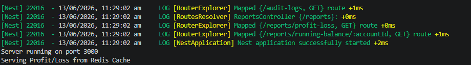
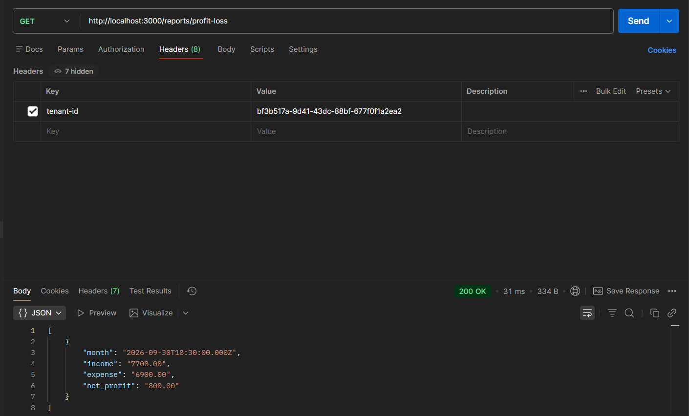
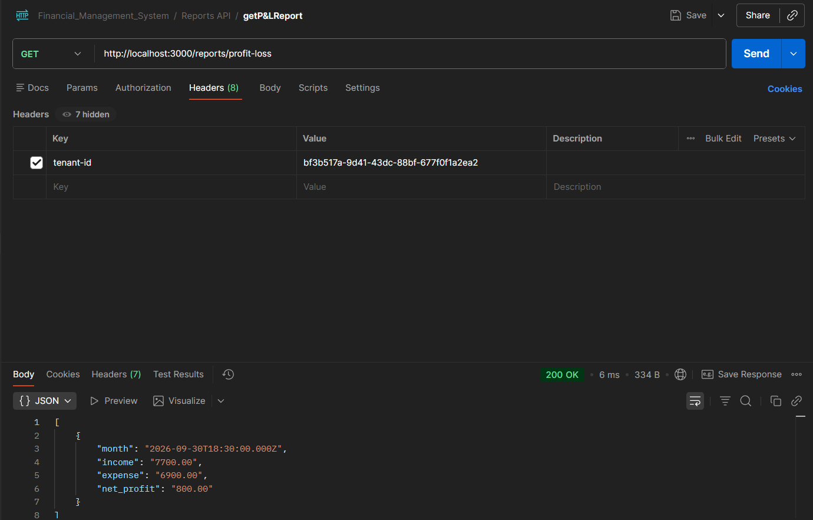
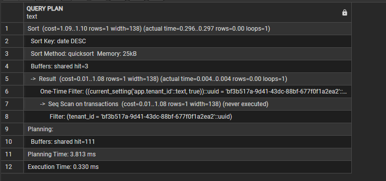
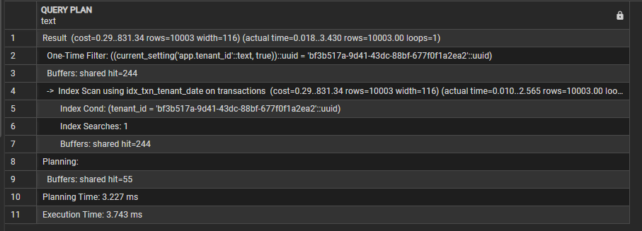

# Financial Management System

A multi-tenant financial management backend built using NestJS, PostgreSQL, TypeORM, Redis, and Row-Level Security (RLS).

This project demonstrates enterprise-grade backend concepts including:

* Multi-tenancy
* Row-Level Security (RLS)
* RBAC (Role-Based Access Control)
* Audit Logging
* Redis Caching
* Query Optimization
* Financial Reporting
* Backup & Recovery Planning

---

# Tech Stack

* NestJS
* TypeScript
* PostgreSQL
* TypeORM
* Redis
* pgAdmin

---

# Features

## Multi-Tenant Architecture

Each tenant operates independently with fully isolated data.

Every:

* user
* account
* transaction
* report
* audit log

belongs to a specific tenant.

Tenant isolation is enforced using:

* PostgreSQL Row-Level Security
* Middleware validation
* Tenant-based filtering

---

## Row-Level Security (RLS)

RLS policies ensure that tenants can only access their own data.

The middleware:

* validates tenant
* checks tenant status
* sets PostgreSQL session variable:

```sql
SET app.tenant_id = '<tenant_id>'
```

RLS policies automatically filter rows based on:

```sql
current_setting('app.tenant_id')
```

---

## RBAC (Role-Based Access Control)

Users have roles:

* admin
* viewer

### Admin Permissions

* create/update accounts
* create/update transactions
* view reports
* view audit logs

### Viewer Permissions

* read-only access

RBAC implemented using:

* custom Roles decorator
* RolesGuard
* x-user-id header validation

---

## Audit Logging

All important operations are logged automatically:

* CREATE
* UPDATE

Audit logs store:

* tenant_id
* user_id
* entity
* entity_id
* old_value
* new_value
* timestamp

Implemented using a global interceptor.

---

## Redis Caching

Redis caching implemented for:

* Profit & Loss Report
* Running Balance Report

Benefits:

* faster response time
* reduced database load
* scalable reporting

Images:

# Redis Terminal Working


# Before Caching


# After Caching


---

## Financial Reporting

### Profit & Loss Report

Monthly report calculating:

* total income
* total expense
* net profit

Uses:

* CTEs
* CASE statements
* aggregation
* DATE_TRUNC
* JOINs

---

### Running Balance Report

Tracks:

* incoming transactions
* outgoing transactions
* cumulative balance over time

Implemented using:

* Window Functions
* SUM() OVER()

---

# Query Optimization

To improve database performance and optimize financial reporting queries, multiple PostgreSQL indexes were implemented on frequently queried columns.

These indexes significantly reduce query execution time by minimizing full table scans and improving filtering, sorting, and join performance.

---

# Indexes Implemented

## 1. Transaction Tenant + Date Index

```sql
CREATE INDEX idx_txn_tenant_date
ON transactions(tenant_id, date DESC);
```

### Purpose

Optimizes queries involving:

* tenant-based filtering
* transaction history
* report generation
* date sorting

### Example Query Optimized

```sql
SELECT *
FROM transactions
WHERE tenant_id = '<tenant_id>'
ORDER BY date DESC;
```

### Benefit

Instead of scanning the full transactions table, PostgreSQL can directly locate transactions belonging to a specific tenant and already sorted by latest date.

---

## 2. Transaction Account Reference Index

```sql
CREATE INDEX idx_txn_accounts
ON transactions(from_account_id, to_account_id);
```

### Purpose

Optimizes:

* running balance reports
* account transaction history
* account-based filtering
* joins involving accounts

### Benefit

Improves performance when retrieving transactions related to:

* outgoing transfers
* incoming transfers
* account activity tracking

---

## 3. Audit Log Entity Index

```sql
CREATE INDEX idx_audit_entity
ON audit_logs(entity, entity_id);
```

### Purpose

Optimizes audit log searches by:

* entity type
* entity identifier

### Example Query Optimized

```sql
SELECT *
FROM audit_logs
WHERE entity = 'accounts'
AND entity_id = '<account_id>';
```

### Benefit

Allows fast retrieval of audit history for:

* accounts
* users
* transactions
* tenants

---

# Query Performance Analysis

PostgreSQL's `EXPLAIN ANALYZE` was used to analyze query execution plans before and after adding indexes.

---

# Before Adding Indexes

Before indexes were added, PostgreSQL performed a:

```txt
Seq Scan
```

This means:

* full table scan
* slower filtering
* higher query cost

### Execution Plan (Before Optimization)



---

# After Adding Indexes

After implementing indexes and inserting large transaction datasets, PostgreSQL switched to:

```txt
Index Scan
```

using:

```txt
idx_txn_tenant_date
```

This significantly improved:

* tenant filtering
* sorting performance
* overall query execution speed

### Execution Plan (After Optimization)



---

# Performance Improvement Summary

| Optimization                 | Result                           |
| ---------------------------- | -------------------------------- |
| Sequential Scan → Index Scan | Faster query execution           |
| Tenant filtering optimized   | Reduced scan cost                |
| Sorted index on date         | Faster ORDER BY                  |
| Account indexes              | Improved running balance queries |
| Audit indexes                | Faster audit history lookup      |

---

# Observations

The PostgreSQL query planner automatically chose:

* Sequential Scan for very small datasets
* Index Scan for larger datasets

This demonstrates:

* proper index utilization
* scalable database design
* efficient query optimization strategy

---

## Soft Delete Architecture

Accounts are never physically deleted.

Instead:

* `is_active = false`

This preserves:

* transaction history
* audit integrity
* referential integrity

Inactive accounts cannot:

* participate in transactions
* appear in active account lists

---

## Tenant Lifecycle Management

Tenants can:

* upgrade plans
* deactivate/reactivate accounts

Inactive tenants cannot:

* create users
* create accounts
* create transactions

---

# Project Structure

```txt
src/
│
├── common/
│   ├── decorators/
│   ├── enums/
│   ├── guards/
│   ├── interceptors/
│   ├── middleware/
│   └── utils/
│
├── modules/
│   ├── tenants/
│   ├── users/
│   ├── accounts/
│   ├── transactions/
│   ├── reports/
│   └── audit-logs/
│
├── database/
│   ├── migrations/
│   ├── schema/
│   └── seeds/
│
└── tests/
```

---

# Database Schema

## Tenants

* id
* name
* plan
* is_active
* created_at
* updated_at
---

## Users

* id
* tenant_id
* email
* role
* password_hash
* created_at
* updated_at
---

## Accounts

* id
* tenant_id
* name
* type
* balance
* is_active
* created_at
* updated_at
---

## Transactions

* id
* tenant_id
* from_account_id
* to_account_id
* amount
* description
* date
* created_at
* updated_at
---

## Audit Logs

* id
* tenant_id
* user_id
* action
* entity
* entity_id
* old_value
* new_value
* created_at
* updated_at
---

# Setup Instructions

## 1. Clone Repository

```bash
git clone <repository_url>
```

---

## 2. Install Dependencies

```bash
npm install
```

---

## 3. Configure Environment Variables

Create `.env`

```env
DB_HOST=localhost
DB_PORT=5432
DB_USERNAME=postgres
DB_PASSWORD=your_password
DB_NAME=financial_management

PORT=3000
```

---

# PostgreSQL Setup

## Create Database

```sql
CREATE DATABASE financial_management;
```

---

# Redis Setup

## Install Docker

Download Docker Desktop.

---

## Run Redis Container

```bash
docker run --name redis-cache -p 6379:6379 -d redis
```

---

## Verify Redis Running

```bash
docker ps
```

---

# Start Application

```bash
npm run start:dev
```

---

# API Headers

Most APIs require:

```txt
tenant-id
x-user-id
```

Example:

```txt
tenant-id: 42fa9215-9e0c-4144-ba40-693b3008e48e
x-user-id: 7f3c8...
```

---

# Sample Workflow

## 1. Create Tenant

```http
POST /tenants
```

---

## 2. Create User

```http
POST /users
```

Headers:

```txt
x-tenant-id
```

---

## 3. Create Accounts

```http
POST /accounts
```

---

## 4. Create Transactions

```http
POST /transactions
```

Transactions allowed only:

* within same tenant
* between active accounts

---

## 5. Generate Reports

```http
GET /reports/profit-loss
```

```http
GET /reports/running-balance/:accountId
```

---

# Security Features

* PostgreSQL RLS
* RBAC Authorization
* Tenant Validation Middleware
* UUID Validation
* Audit Logging
* Soft Delete Strategy

---

# Backup & Recovery Strategy

## Full Database Backup

Daily backup using:

```bash
pg_dump -U postgres financial_management > backup.sql
```

---

## WAL Archiving

Configured for Point-in-Time Recovery (PITR).

---

## Recovery Objectives

### RTO (Recovery Time Objective)

Target recovery time:

* 30 minutes

### RPO (Recovery Point Objective)

Maximum acceptable data loss:

* 5 minutes

---

# Recovery Runbook

## Step 1 — Stop Application

```bash
npm stop
```

---

## Step 2 — Restore Database

```bash
psql -U postgres financial_management < backup.sql
```

---

## Step 3 — Restore WAL Logs

Replay WAL archives for PITR.

---

## Step 4 — Verify Data Integrity

Check:

* tenants
* users
* accounts
* transactions
* audit logs

---

## Step 5 — Restart Services

```bash
npm run start:dev
```

---

# Performance Optimization

Implemented:

* Redis caching
* database indexes
* optimized SQL queries
* window functions
* CTEs

---


# Author

Raj Prabhakar
